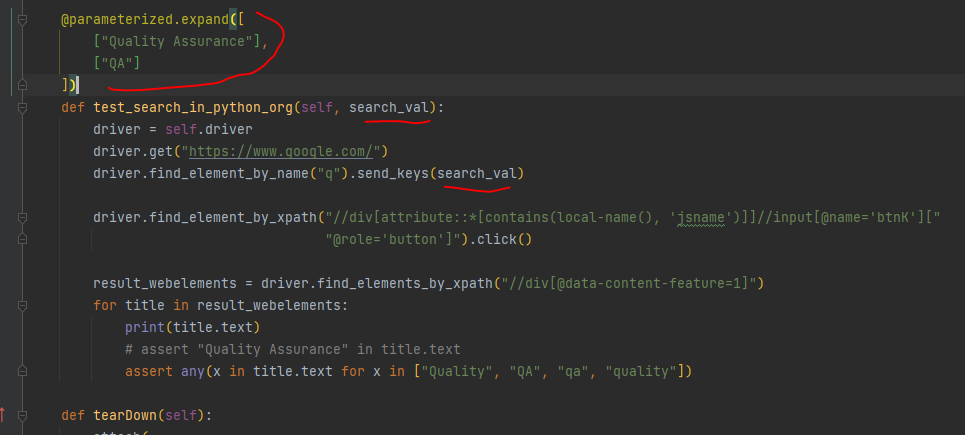

python -m unittest test_demo_browser.py

python  test_demo_browser.py EDGE

pytest -v -s test_demo_browser.py

### ---------------------------------

pytest -v -s tests/ --alluredir=./allureReports

allure serve  ./allureReports

pytest .\tests\test_e2e.py -v -s --browser_name=edge --URL=https://google.com

### ---------------------------------

pytest -v -s

pytest -v -s -k browser

pytest -v -s -m smoke

pytest  --capture sys  --html=report.html

pytest pytestdemo/  --capture sys -rP  --html=report.html

pytest -s -v tests/   --html=report.html 

### ---------------------------------

